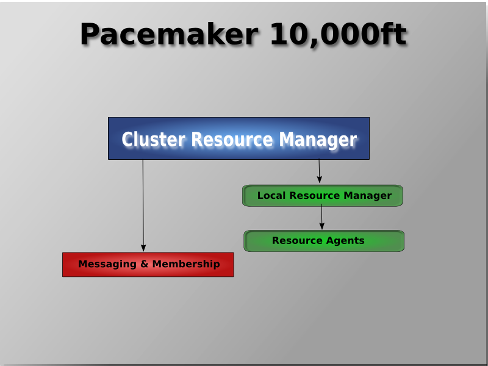
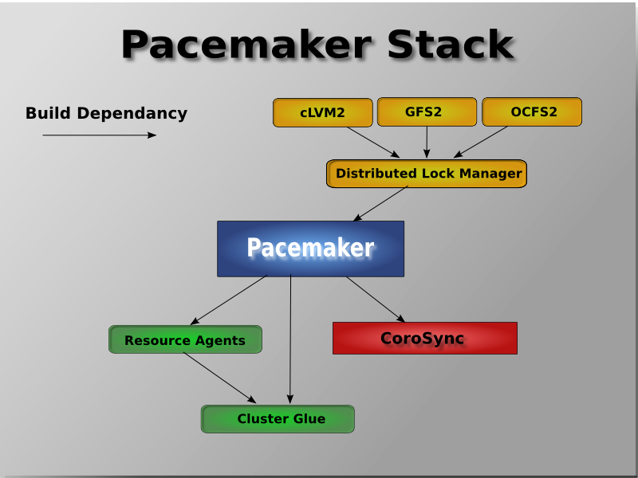
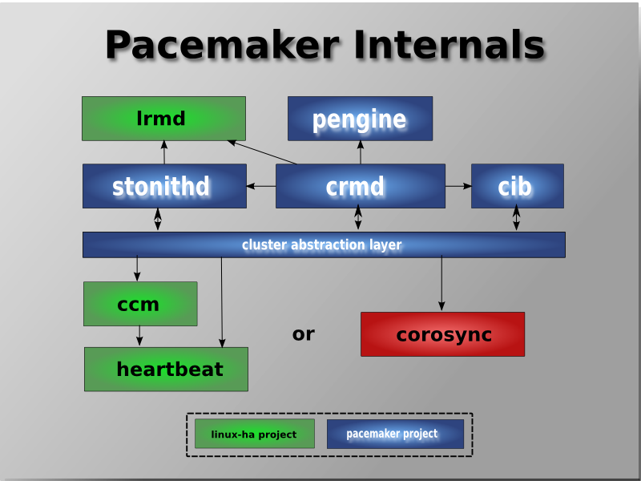
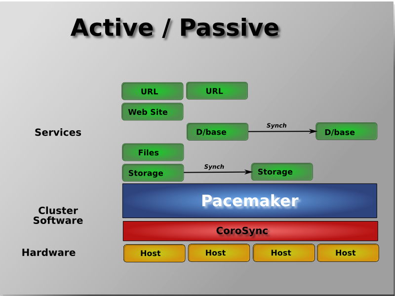
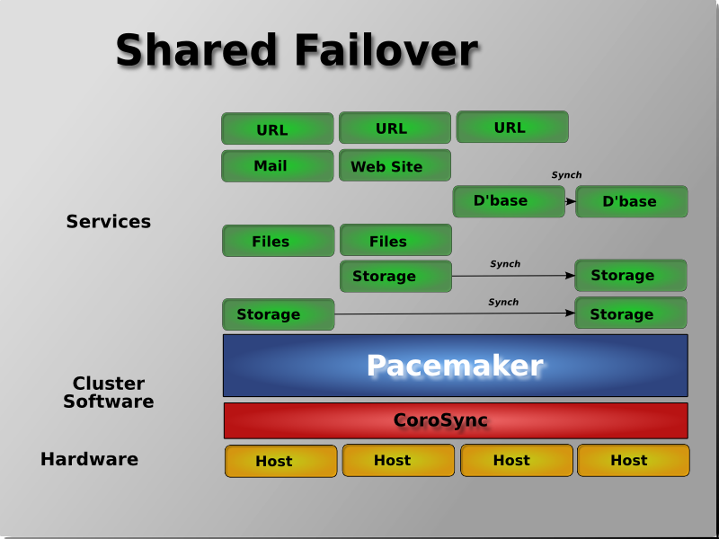
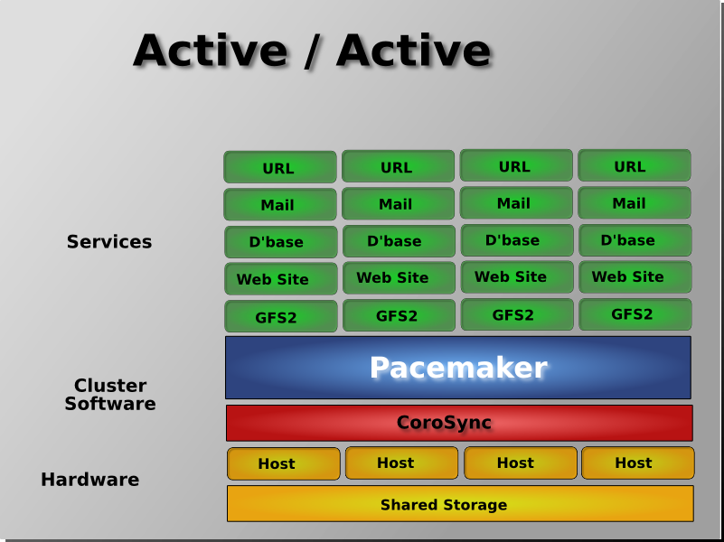

# Tổng quan về pacemaker

___

# Mục lục

+ [Pacemaker là gì?](#concepts)
+ [Chức năng của pacemaker](#feature)
+ [Kiến trúc của pacemaker](#infras)
+ [Các mô hình triển khai pacemaker](#typically)
+ [Các nội dung khác](#others-content)

___

# Nội dung

+  <a name="concepts">Pacemaker là gì?</a>

	- pacemaker là một cluster quản lý các resource, nó có khả năng hoạt động với hầu hết các dịch vụ cluster bằng cách phát hiện và phục hồi từ node và resource-level bằng các sử dụng khả năng trao đổi và các mối quan hệ được cung cấp bởi kiến trúc hạ tầng ưa thích của bạn ( Corosync hoặc Heartbeat).

+  <a name="feature">Chức năng của pacemaker</a>

	- Phát hiện và phục hồi các hỏng hóc của node và các dịch vụ
	- Không yêu cầu chia sẻ không gian lưu trữ
	- Agnostic resource, anything that can be scripted can be clustered
	- Hỗ trợ STONITH để đảm bảo toàn vẹn dữ liệu
	- Hỗ trợ các cluster lớn và nhỏ
	- Hỗ trợ cả cluster quorate và resource clusters
	- Hỗ trợ thiết lập dự phòng bất kỳ
	- Tự động tái tạo cấu hình có thể được cập nhật từ bất kỳ node nào
	- Khả năng chỉ định các yêu cầu dịch vụ cluster-wide, colocation và anti-colocation
	- Hỗ trợ loại dịch vụ tiên tiến
		- Bản sao: đối với các dịch vụ cần phải hoạt động trên nhiều node
		- Đa trạng thái: cho các dịch vụ với nhiều chế độ (ví dụ master / slave, primary / secondary)
	- Thống nhất, có kịch bản, những công cụ quản lý cluster.

+  <a name="infras">Kiến trúc của pacemaker</a>
	
	- Ở mức độ cao nhất, các cluster được tạo thành từ 3 phần:

		+ Kiến trúc hạ tầng chính của cluster cung cấp khả năng trao đổi, mối quan hệ... (màu đỏ)
		+ Thành phần nhận biết non-cluster  (màu xanh lá lam)
		+ "A brain" (màu xanh lá cây): xử lý và phản ứng với các sự kiện từ cluster (node rời hoặc tham gia) và các resource (ví dụ: giám sát các hỏng hóc) cũng như thay đổi cấu hình từ quản trị viên. Để đối phó với tất cả các sự kiện này, Pacemaker sẽ tính toán trạng thái lý tưởng của cluster và vẽ ra một con đường để đạt được nó.

			> 
	
	- Khi kết hợp Corosync, Pacemaker cũng hỗ trợ những hệ thống cluster mã nguồn mở phổ biến. Dựa vào tiêu chuẩn gần đây trong cộng đồng cluster filesystem, họ sử dụng một chương trình phân phối khóa chung, sử dụng Corosync dùng khả năng liên lạc của nó với Pacemaker đối với những thành viên của mình (những node nào up hay down) và những dịch vụ bảo vệ.

		> 

	- Các thành phần bên trong của pacemaker

		> 

		+ Cluster Information Base (CIB)

			CIB sử dụng XML để biểu diễn cả cấu hình của cụm và trạng thái hiện tại của tất cả các tài nguyên trong cluster. Các nội dung của CIB được tự động giữ đồng bộ trên toàn bộ cụm và được sử dụng bởi PEngine để tính toán trạng thái lý tưởng của cluster và làm thế nào để nó đạt được.

		+ Cluster Resource Management Daemon (CRMd)

			Các hành động resource của Pacemaker cluster được chuyển qua daemon này. Resources được quản lý bởi CRMd và có thể được truy vấn bởi các hệ thống client, di chuyển nhanh chóng và thay đổi khi cần thiết.

			Mỗi node của cluster cũng bao gồm một trình quản lý tài nguyên cục bộ LRMd (Local Resource Management Daemon) hoạt động tương tự giữa CRMd và các resource. LRMd truyền lệnh từ CRMd tới các agent chẳng hạn như khởi động (start) và dừng lại (stop) hay chuyển tiếp thông tin trạng thái 

		+ Policy Engine (PEngine)

			Chịu trách nhiệm về việc bắt đầu thay đổi trạng thái trong cluster

		+ Shoot the Other Node in the Head (STONITH)
			
			Là giải pháp tránh trường hợp "split brain" trong cluster

			Được triển khai kết hợp với một "power switch". Hoạt động như một resource trong cluster xử lý các yêu cầu về fencing. Buộc các node phải dừng lại (shutdown) và loại bỏ chúng khỏi cluster để đảm bảo toàn vẹn dữ liệu. STONITH được cấu hình trong CIB và có thể được theo dõi như là một tài nguyên cluster thông thường.
			
+  <a name="typically">Các mô hình triển khai pacemaker</a>

	- Pacemaker không có giới hận về cách triển khai của bạn, chính điều này mà nó cho phép ta có thể triển khai theo hầu hết các mô hình như:
		+ Active/ Active
		+ Active/ Passive
		+ N + 1
		+ N + M
		+ N to 1
		+ N to M

	- Dưới đây là một vài mô hình triển khai:

		+ Active / Passive
		
			> 

			sử dụng Pacemaker và DRBD là giải pháp hiệu quả về chi phí cho nhiều tình huống High Availability.

		
		+ Chia sẻ Failover
			
			> 

			Pacemaker có thể làm giảm đáng kể chi phí phần cứng bằng cách cho phép một số nhóm Active/ Passive được kết hợp và chia sẻ một node sự phòng chung

		+ Active/ Active ( N to N)

			> 

			khi bộ nhớ chia sẽ sẵn sàng, mọi node đều có khả năng sử dụng để chuyển đổi dự phòng. Pacemaker thậm chí có thể chạy nhiều bản sao của các dịch vụ để trải đều khối lượng công việc
___

- # <a name="others-content">Các nội dung khác</a>

- [B. Tổng quan về pacemaker](docs/pacemaker-overview.md)
	- [B.1 Tổng quan về quorum](docs/quorum-overview.md)
	- [B.2 Tổng quan về STONITH/ fencing](docs/fencing-overview.md)
	- [B.3 Tổng quan về resource](docs/resource-overview.md)
